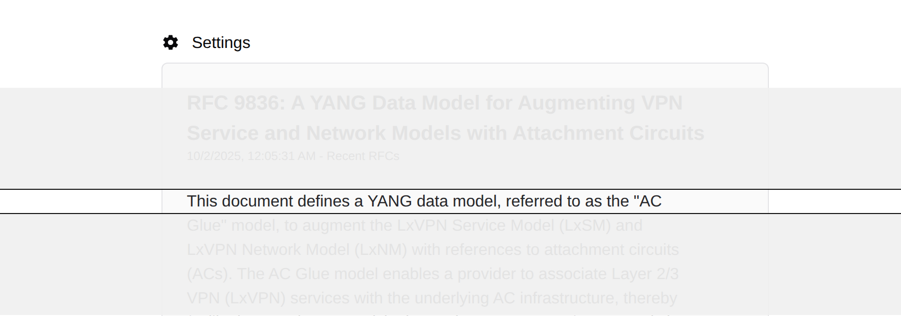
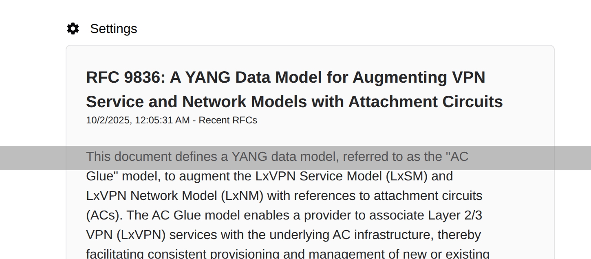

Screen ruler running on X Window System.





## Installation

Download the `xruler` binary from the [releases
page](https://github.com/kijimaD/xruler/releases/latest).

If you want to make the ruler transparent, need to run compton!

```shell
$ apt install compton
$ compton
```

## Development

run
```shell
$ go run .
```

trace X Window log
```shell
$ go build . && xtrace -o output.log ./xruler
```

## Reference

Inspired by [swillner/highlight-pointer](https://github.com/swillner/highlight-pointer).
